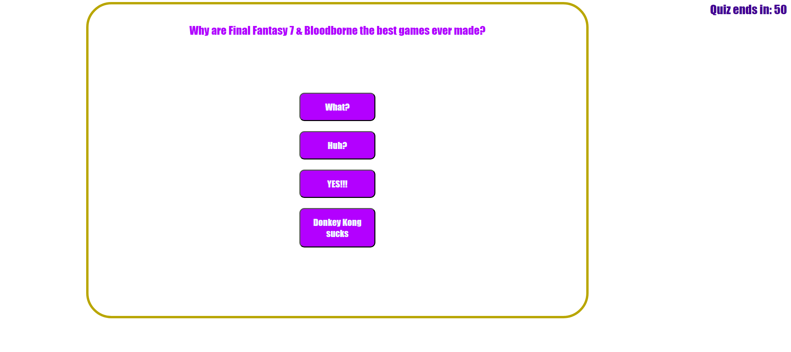

# quiz
Creating a quiz page to test peoples knowledge on the best games and cryptocurrency.

## Users Story
As a coding student I want to make a quiz page with the following User Story and Acceptance Criteria:

#### -Users Story-
AS A coding boot camp student
I WANT to take a timed quiz on JavaScript fundamentals that stores high scores
SO THAT I can gauge my progress compared to my peers

#### -Acceptance Criteria-

* GIVEN I am taking a code quiz
* WHEN I click the start button
* THEN a timer starts and I am presented with a question
* WHEN I answer a question
* THEN I am presented with another question
* WHEN I answer a question incorrectly
* THEN time is subtracted from the clock
* WHEN all questions are answered or the timer reaches 0
* THEN the game is over
* WHEN the game is over
* THEN I can save my initials and my score

## Installation

N/A

## Usage

This site will be used to display my work.

## Credits

Lukas Durkin

## License
Please refer to license in the repo

## URL
https://dukelurkin.github.io/password-generator/

## Image

